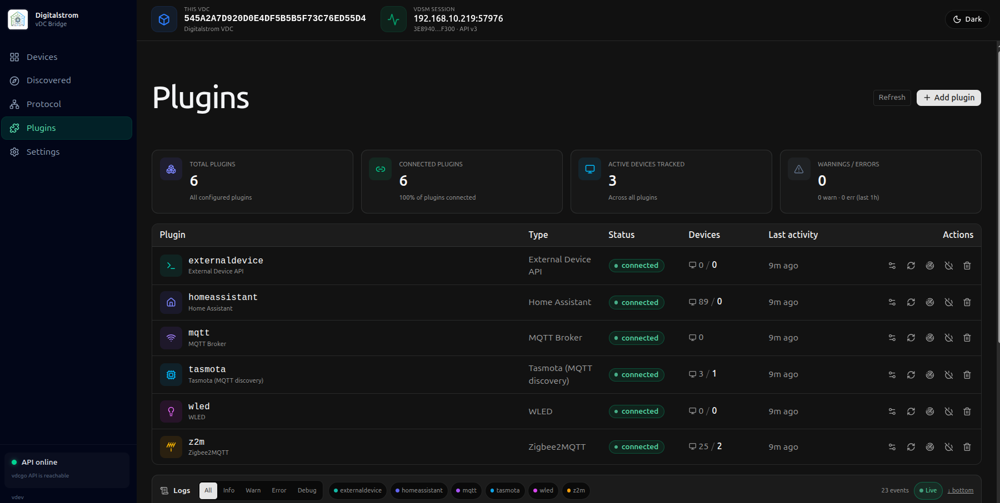
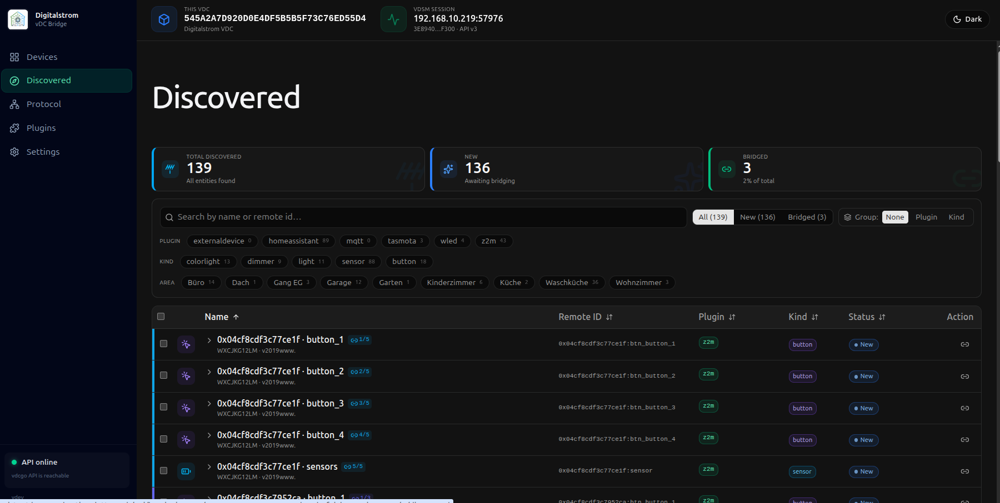
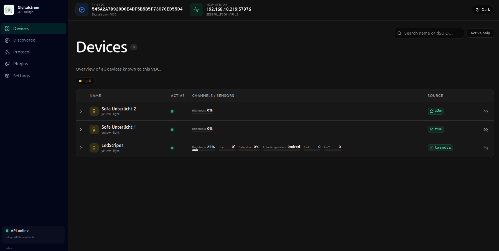

# digitalSTROM vDC Bridge

A Go implementation of a [Virtual Device Connector (vDC)](https://developer.digitalstrom.com/Architecture/vDC-API.pdf) for the [digitalSTROM](https://www.digitalstrom.com/) smart home system, with a web-based configuration UI and a plugin system for bridging third-party devices.

## Features

- **Full vDC API compatibility** — protobuf wire protocol, all 16 inbound message types, scenes, channels, sensor descriptors, and DNS-SD advertisement
- **Web UI** — schema-driven plugin management, device discovery, and bridge mapping (embedded in the binary, no separate server needed)
- **Plugin system** — shared MQTT broker service with plugins for:
  - **MQTT** — shared broker connection (required by Tasmota and Zigbee2MQTT)
  - **Home Assistant** — discovers lights and sensors via the WebSocket API
  - **WLED** — discovers WLED LED controllers via mDNS
  - **Tasmota** — discovers devices via Tasmota MQTT discovery (`SetOption19 1`)
  - **Zigbee2MQTT** — discovers Zigbee devices via `<base>/bridge/devices`
- **Persistent storage** — scenes, device configs, and bridge mappings survive restarts

## Screenshots

| Plugins | Discovered | Devices |
|---|---|---|
|  |  |  |

## Acknowledgements

This project is heavily inspired by and builds upon the concepts and protocol implementation from [plan44/vdcd](https://github.com/plan44/vdcd) by Lukas Zeller. The vDC API protocol handling, device model abstractions, and overall architecture follow the patterns established in that project. Many thanks to plan44 for the open-source reference implementation.

## Quick Start

### Docker (standalone)

```bash
docker run -d \
  --name digitalstrom-vdc-bridge \
  --network host \
  -v ./data:/data \
  ghcr.io/splattner/digitalstrom-vdc-bridge:latest
```

Open **http://localhost:8090** for the web UI.

> **`--network host` is required** for mDNS (DNS-SD) to work so the digitalSTROM Server can discover the bridge automatically. Without it, multicast traffic is isolated inside the Docker bridge network and the dSS will not find the bridge.

### Docker Compose

```yaml
services:
  vdc-bridge:
    image: ghcr.io/splattner/digitalstrom-vdc-bridge:latest
    restart: unless-stopped
    network_mode: host   # required for mDNS discovery by the dSS
    volumes:
      - ./data:/data
```

> With `network_mode: host` the container shares the host's network stack, which means the mDNS announcements are visible to the rest of the LAN and the digitalSTROM Server can discover the bridge without any manual configuration.

## Home Assistant Add-on

Add this repository to the Home Assistant add-on store:

```
https://github.com/splattner/digitalstrom-vdc-bridge
```


[](https://my.home-assistant.io/redirect/supervisor_add_addon_repository/?repository_url=https%3A%2F%2Fgithub.com%2Fsplattner%2Fdigitalstrom-vdc-bridge)

Then install **digitalSTROM vDC Bridge** from the add-on store. After starting the add-on, open its web UI via the **Open Web UI** button.

> **Tip:** Enable ingress to access the UI directly from the HA sidebar.

### Add-on options

| Option | Default | Description |
|---|---|---|
| `description` | `digitalSTROM vDC Bridge` | Instance name advertised via DNS-SD and shown in the dSS configurator |
| `vdcapi_port` | `8340` | Port the dSS connects to (protobuf vDC API). The mDNS advertisement includes this port so the dSS finds it automatically. |
| `listen_port` | `8999` | Port for the [External Device API](docs/plugins/externaldevice.md) — only relevant if you connect external scripts to the bridge. Not used by the dSS itself. |
| `non_local` | `true` | Accept vDC API connections from any host (required since the dSS is not on the same machine) |
| `no_discovery` | `false` | Disable DNS-SD advertisement |
| `no_auto` | `false` | Publish the vDC with the `noauto` flag |

## Build from Source

**Prerequisites:** Go 1.23+, Node.js 20+

```bash
# Clone
git clone https://github.com/splattner/digitalstrom-vdc-bridge.git
cd digitalstrom-vdc-bridge

# Build web UI first (outputs to pkg/httpapi/webdist, gets embedded in the binary)
make web

# Build the Go binary
make build

# Or both in one step
make

# Run tests
make test
```

The resulting binary is `./vdcgo-daemon`.

### Run locally

```bash
./vdcgo-daemon \
  --non-local \
  --http-listen :8090 \
  --datadir ./data
```

The bridge advertises itself via mDNS on the default vDC API port (`8340`). The digitalSTROM Server discovers it automatically — no manual configuration in the dSS configurator is needed.

### Available flags

| Flag | Default | Description |
|---|---|---|
| `--http-listen` | *(disabled)* | Address for the web UI, e.g. `:8090` |
| `--datadir` | *(none)* | Persist scenes, mappings, and plugin configs to this directory |
| `--vdcapi-port` | `8340` | Port the dSS connects to (advertised via DNS-SD) |
| `--dsuid` | *(generated)* | Fixed 34-hex-digit dSUID (auto-generated and persisted if omitted) |
| `--description` | `vdcgo external` | DNS-SD instance name shown in the dSS configurator |
| `--non-local` | false | Accept vDC API connections from non-localhost clients |
| `--nodiscovery` | false | Disable DNS-SD advertisement |
| `--avahi-dbus` | false | Use Avahi D-Bus for DNS-SD (useful in containers with host D-Bus mounted) |
| `--noauto` | false | Advertise vDC as `noauto` |
| `--novdcapi` | false | Disable the vDC API listener entirely |

## Plugin Configuration

Plugins are managed via the web UI at `http://<host>:8090`. When `--datadir` is set, the configuration is persisted to `plugins.json`.

### MQTT (broker)

Required by Tasmota and Zigbee2MQTT plugins. Configure one shared MQTT broker instance, then reference it by `id` in the other plugins.

| Field | Description |
|---|---|
| `broker` | MQTT broker URL, e.g. `tcp://192.168.1.1:1883` |
| `clientId` | MQTT client ID (default: `vdcgo-<random>`) |
| `username` / `password` | Optional credentials |
| `keepAlive` | Keep-alive interval in seconds (default: 30) |

### Home Assistant

| Field | Description |
|---|---|
| `url` | WebSocket URL, e.g. `ws://homeassistant.local:8123/api/websocket` |
| `token` | Long-lived access token |

### WLED

Discovers WLED controllers automatically via mDNS — no configuration needed beyond the plugin `id`.

### Tasmota

| Field | Description |
|---|---|
| `broker` | Id of the MQTT plugin instance |
| `discoveryPrefix` | Tasmota discovery root (default: `tasmota/discovery`) |

Enable discovery on each Tasmota device: `SetOption19 1`

### Zigbee2MQTT

| Field | Description |
|---|---|
| `broker` | Id of the MQTT plugin instance |
| `baseTopic` | Z2M `mqtt.base_topic` (default: `zigbee2mqtt`) |

## Architecture

```
digitalSTROM controller
        │ TCP (protobuf)
        ▼
┌─────────────────────────────────┐
│  vdcgo-daemon                   │
│  ┌─────────────┐  ┌──────────┐  │
│  │  vDC API    │  │ Web UI   │  │
│  │  server     │  │ :8090    │  │
│  └──────┬──────┘  └──────────┘  │
│         │ bridge.Host           │
│  ┌──────▼──────────────────┐    │
│  │  Plugin registry        │    │
│  │  mqtt │ ha │ wled │ ... │    │
│  └──────────────────────────┘   │
└─────────────────────────────────┘
       │           │        │
     MQTT        HA WS    mDNS
     broker      API     (WLED)
```

## Contributing

Pull requests are welcome. Run `make test` before submitting. For larger changes, open an issue first.

## License

[MIT](LICENSE)
